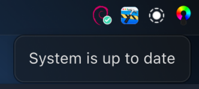
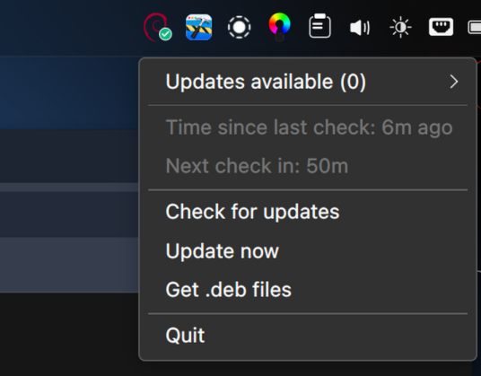
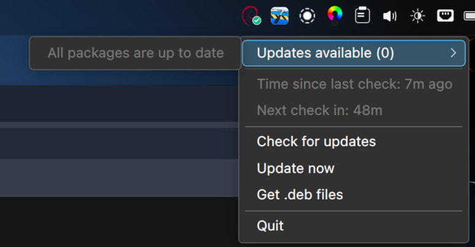
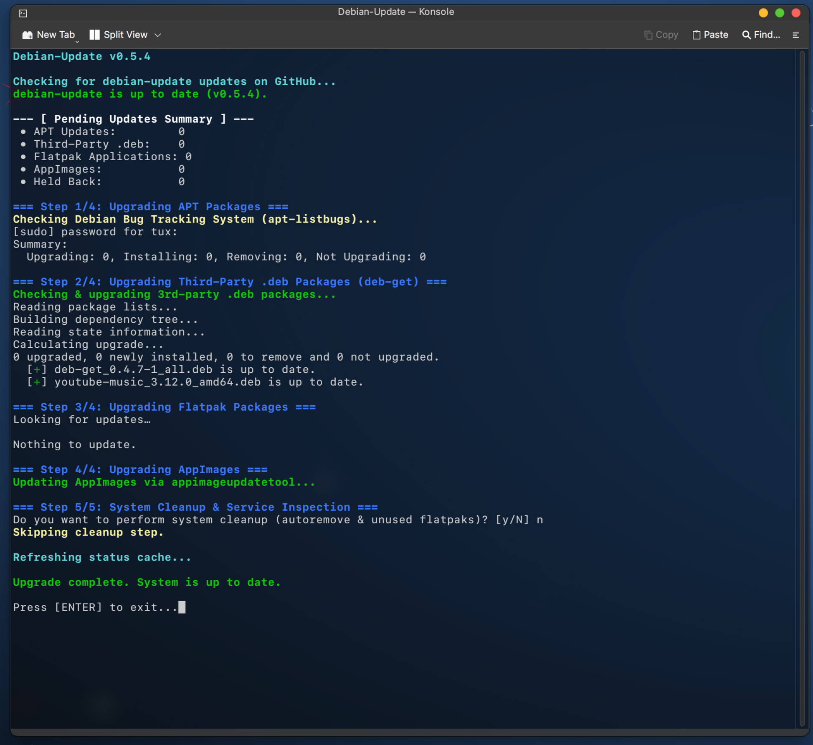
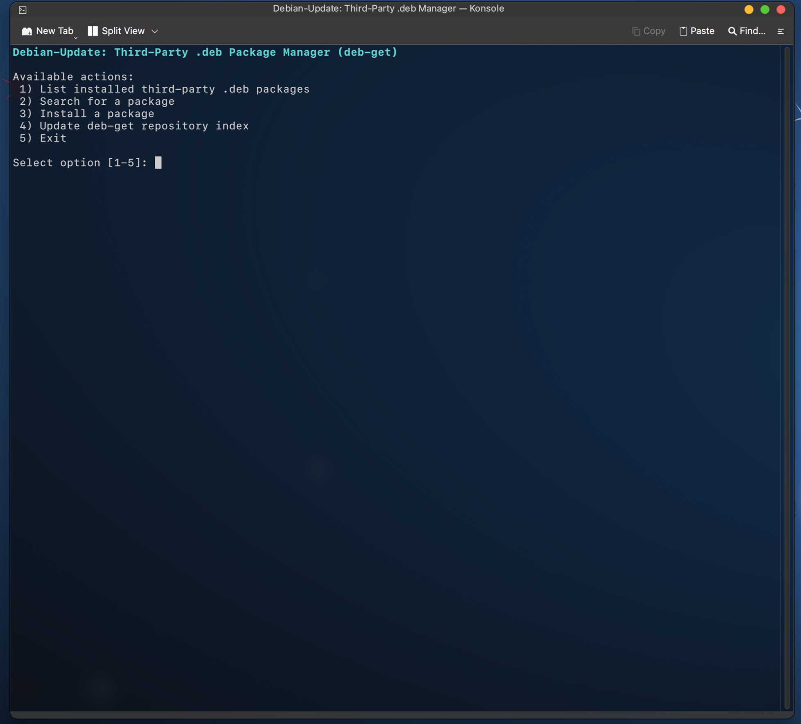

# debian-update

A lightweight, multi-source update management system and system tray integration designed specifically for Debian (including Debian Sid).

> **Disclaimer:** This software is developed with the assistance of AI, but is actively maintained, debugged, and used daily by the author in a production environment to identify and fix issues.

---

## 📸 Screenshots & Previews

### System Tray Integration
<p float="left">
  
  
  
</p>

### Command Line Interface (CLI)
<p float="left">
  
</p>

<p float="left">
  
</p>

---

## ✨ Features

* **Multi-Source Update Tracking:**
  * **APT Packages:** Native APT update checks using dist-upgrade simulation mode for accurate tracking during Debian Sid/testing library transitions.
  * **Third-Party .deb Packages (Optional):** Integrated management via deb-get (*100% optional*).
  * **Flatpaks:** Checks system and user Flatpak applications and runtimes.
  * **AppImages (Optional):** Scans and updates AppImages using AM or appimageupdatetool (*100% optional*).

* **Self-Updating Mechanism:**
  * Checks GitHub Releases prior to running system updates.
  * Safely upgrades its own .deb package in-place using RAM buffering and process re-execution without interrupting execution.
  * *Notice: If you experience any issues with self-updating, please submit an issue on GitHub for immediate resolution.*

* **Desktop Integration:**
  * **Background Service:** Periodic checks managed by a non-intrusive systemd timer (OnBootSec=2min, OnUnitActiveSec=1h).
  * **System Tray Indicator:** Qt-based status icon displaying pending update counts in tooltip and context menu.
  * **Notifications:** Native desktop notifications via KDE Plasma / Freedesktop notification daemon.

---

## 🚀 Installation

### Option A: Download Pre-built Package
Download  from the latest GitHub Release.

### Option B: Build from Source
```bash
git clone [https://github.com/TuxOfValhalla/debian-update.git](https://github.com/TuxOfValhalla/debian-update.git)
cd debian-update
./build_deb.sh
```

### Install Package
Install the  package (whether downloaded or self-built):

```bash
sudo apt install ./debian-update.deb
```

---

## 📄 License & Disclaimer

Distributed under the **GPL-3.0 License**.

### ⚠️ Project & Trademark Disclaimer
* **Independent Project:**  is an independent open-source tool and is **not** affiliated with, endorsed by, or part of the official Debian Project.
* **Logo Usage:** The Debian logo and trademark are property of Software in the Public Interest, Inc. (SPI) and are used under the Debian Logo License / fair use principles for project identification purposes only.
