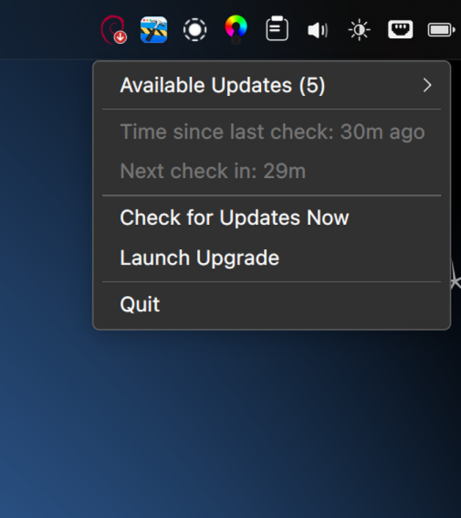
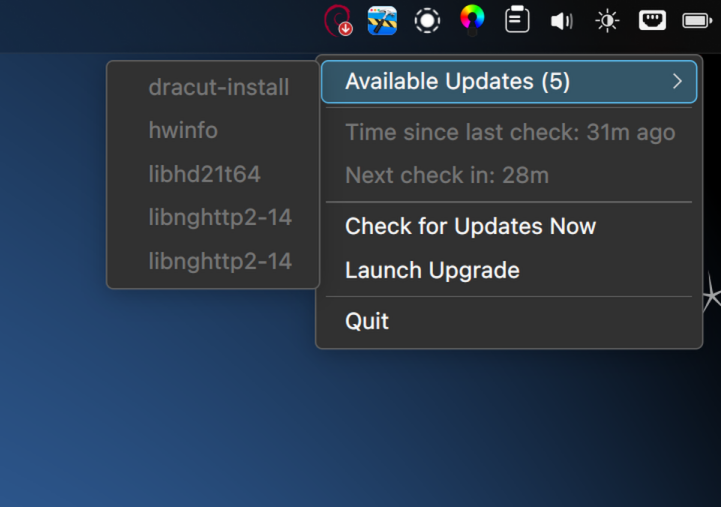
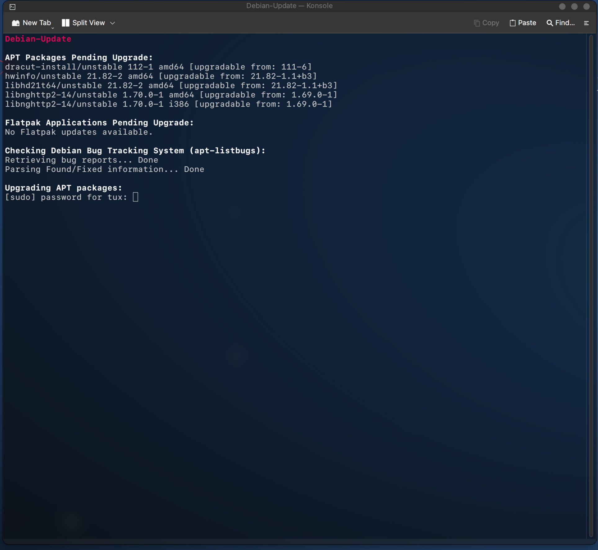
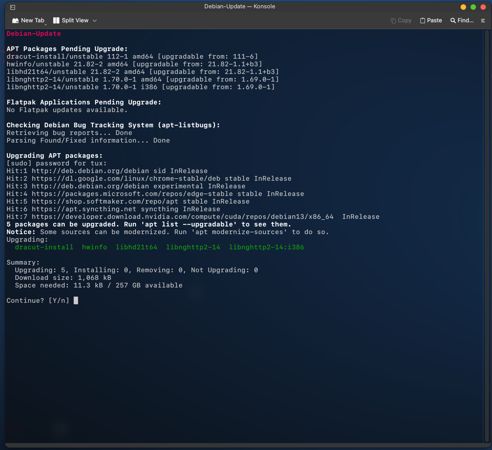

# Debian Update Suite

A lightweight system tray indicator and interactive CLI upgrade suite for **Debian** (optimized for **Testing** and **Sid** branches).

It periodically checks for **APT** and **Flatpak** updates in the background using a systemd timer, alerts you via a system tray icon, and allows you to execute safe upgrades in your preferred terminal emulator.

> **Note & Disclaimer:**
> This package was built with the help of AI, but has been quality controlled, tested, and used by myself to make sure it works. This application is currently in an **alpha** stage and will continue to receive updates in the future.

---

## 📸 Screenshots

### System Tray Applet

| Preview 1 | Preview 2 | Preview 3 |
| :---: | :---: | :---: |
|  |  |  |

### Interactive CLI Suite

| Package Preview & Bug Check | Interactive Upgrade & Service Inspection |
| :---: | :---: |
|  |  |

---

## ⚡ Features

- **Background Systemd Check**: Runs a lightweight, passwordless background check every hour.
- **System Tray Indicator**: Real-time tray icon displaying available APT & Flatpak updates, held-back packages, and system reboot requirements.
- **Safety First**: Executes standard `apt upgrade` (no destructive `full-upgrade`) and checks for open bugs via `apt-listbugs`.
- **Universal Terminal Detection**: Automatically detects and launches your favorite terminal (`konsole`, `gnome-terminal`, `ptyxis`, `xfce4-terminal`, `alacritty`, `kitty`, `foot`, etc.).
- **System Cleanup**: Safely cleans package caches, uninstalls unused Flatpaks, and purges orphan dependencies (`autoremove`).
- **Service Inspection**: Automatically inspects affected daemons and services using `needrestart`.

---

## 📦 Installation

### Option 1: Install Pre-built `.deb` Package (Recommended)

Build and install the Debian package directly from source:

1. Clone the repository:

```bash
git clone https://github.com/TuxOfValhalla/debian-update.git
cd debian-update
```

2. Build the package:

```bash
chmod +x build_deb.sh
./build_deb.sh
```

3. Install via APT:

```bash
sudo apt install ./debian-update.deb
```

---

## ⚖️ Disclaimer & Trademarks

- **Debian** is a registered trademark owned by *Software in the Public Interest, Inc.*
- This project (`debian-update`) is an independent open-source tool and is **not** officially affiliated with, endorsed by, or sponsored by the Debian Project or Software in the Public Interest, Inc.
- The Debian logo is used under the terms of the Debian Open Use Logo license (LGPLv3 / CC BY-SA 3.0).

---

## 📄 License

This project is licensed under the **GNU General Public License v3.0 (GPLv3)**.
